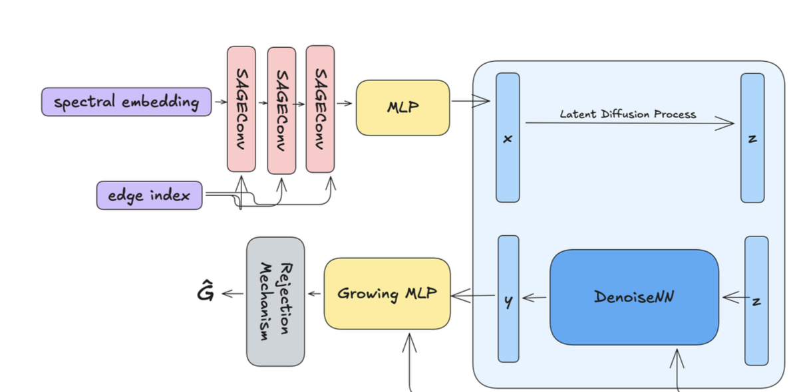

# Generation of Conditioned Graphs

This repository corresponds to the ALTEGRAD -MVA course- project, where the objective is to generate graphs with specific properties leveraging the Neural Graph Generator (NGG) architecture described in ((Evdaimon and al., [2024] https://arxiv.org/pdf/2403.01535)). This approach utilizes conditioned latent diffusion models for graph generation, combining a Variational Autoencoder (VAE) to process the graph structure with a diffusion process in the latent vector space. The diffusion is guided by conditioning vectors that encode graph statistics, ensuring the generated graphs align with desired properties.

## Model architecture 

